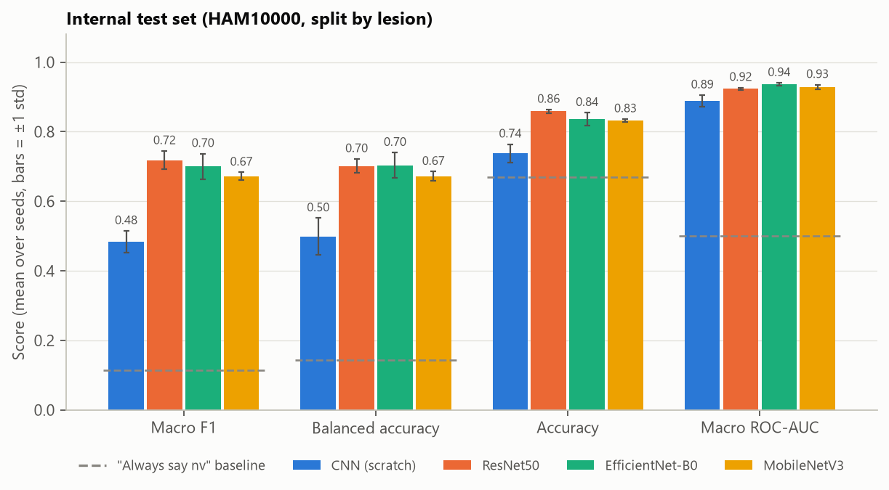
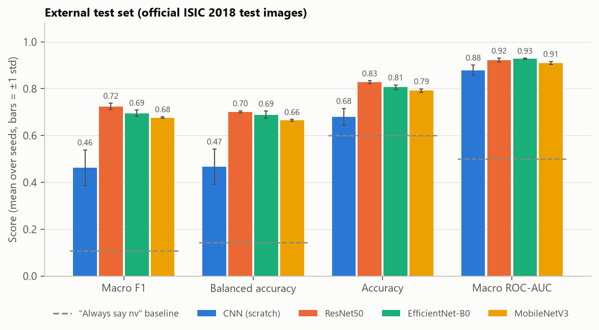
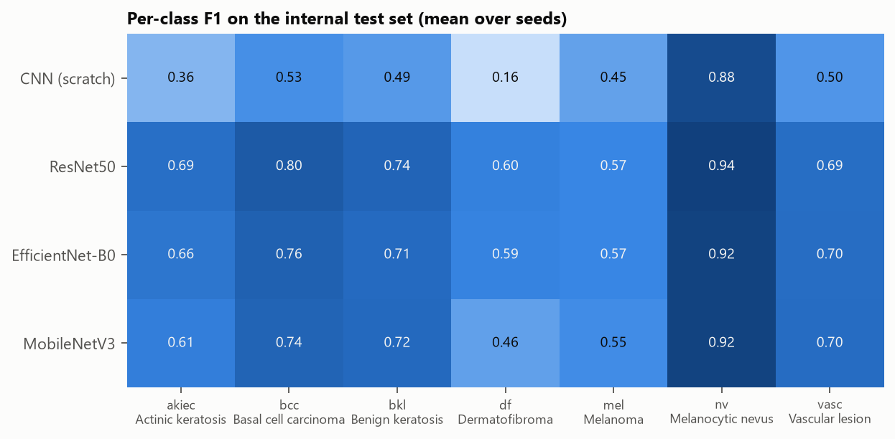
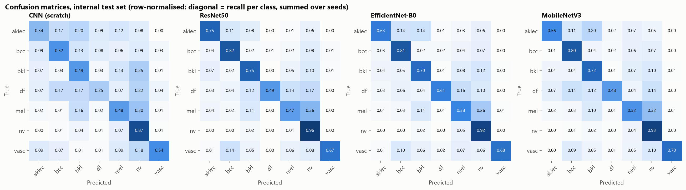
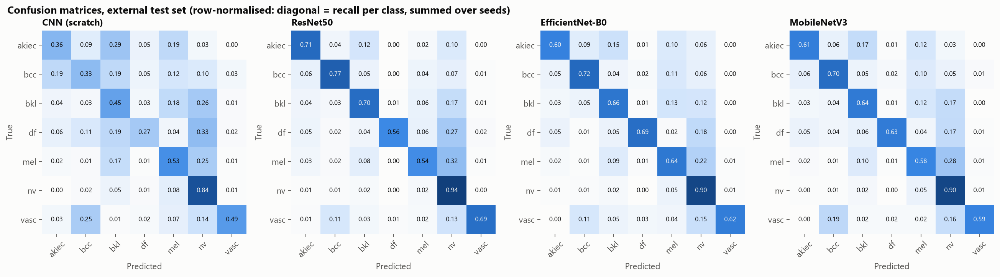
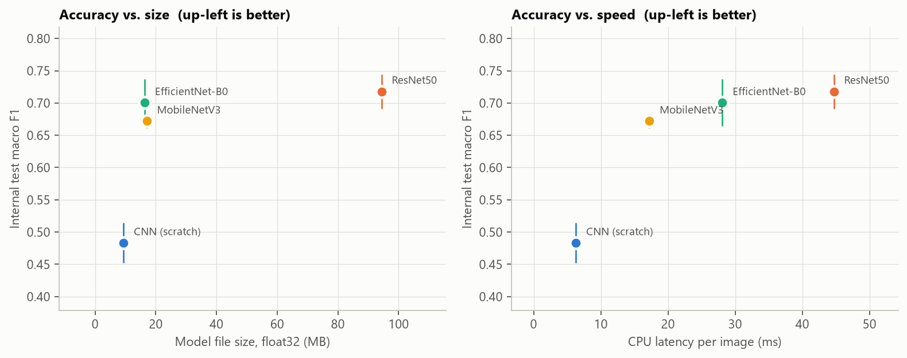
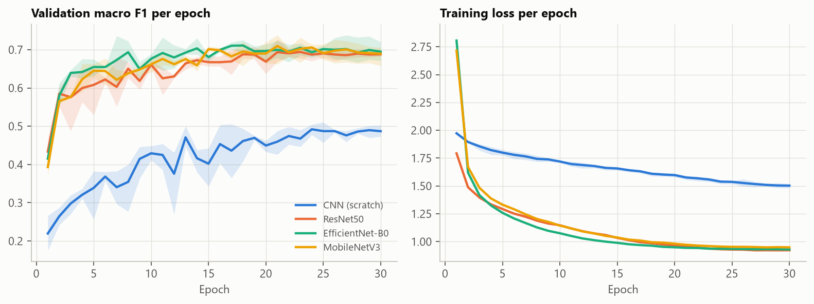

# Results

Mean ± standard deviation over 3 training seed(s) per model. Generated by `src/report.py`.

## Internal test set (2,004 HAM10000 images, split by lesion)

| Model | Macro F1 | Balanced acc. | Accuracy | Macro AUC | Melanoma recall |
|---|---|---|---|---|---|
| CNN (scratch) | 0.483 ± 0.031 | 0.499 ± 0.053 | 0.738 ± 0.026 | 0.888 ± 0.017 | 0.482 ± 0.137 |
| ResNet50 | 0.718 ± 0.027 | 0.701 ± 0.020 | 0.858 ± 0.005 | 0.924 ± 0.003 | 0.474 ± 0.070 |
| EfficientNet-B0 | 0.700 ± 0.036 | 0.704 ± 0.036 | 0.836 ± 0.019 | 0.937 ± 0.004 | 0.580 ± 0.068 |
| MobileNetV3 | 0.672 ± 0.011 | 0.672 ± 0.013 | 0.833 ± 0.004 | 0.929 ± 0.006 | 0.518 ± 0.027 |
| *Always answer "nv"* | 0.115 | 0.143 | 0.669 | 0.500 | 0.000 |

## External test set (1,511 ISIC 2018 test images)

| Model | Macro F1 | Balanced acc. | Accuracy | Macro AUC | Melanoma recall |
|---|---|---|---|---|---|
| CNN (scratch) | 0.462 ± 0.077 | 0.467 ± 0.075 | 0.680 ± 0.036 | 0.879 ± 0.022 | 0.534 ± 0.139 |
| ResNet50 | 0.724 ± 0.014 | 0.701 ± 0.004 | 0.828 ± 0.006 | 0.922 ± 0.008 | 0.544 ± 0.061 |
| EfficientNet-B0 | 0.695 ± 0.013 | 0.689 ± 0.015 | 0.806 ± 0.010 | 0.928 ± 0.002 | 0.641 ± 0.064 |
| MobileNetV3 | 0.677 ± 0.004 | 0.664 ± 0.004 | 0.792 ± 0.008 | 0.909 ± 0.007 | 0.581 ± 0.021 |
| *Always answer "nv"* | 0.107 | 0.143 | 0.601 | 0.500 | 0.000 |

## Size and speed

| Model | Params (M) | GFLOPs | File (MB, fp32) | Train time (min) | GPU ms/img | CPU ms/img | Best epoch |
|---|---|---|---|---|---|---|---|
| CNN (scratch) | 2.35 | 1.18 | 9.4 | 2.4 | 1.1 | 6.3 | 21 |
| ResNet50 | 23.52 | 8.17 | 94.4 | 12.6 | 5.2 | 44.7 | 21 |
| EfficientNet-B0 | 4.02 | 0.77 | 16.3 | 8.8 | 7.3 | 28.1 | 17 |
| MobileNetV3 | 4.21 | 0.43 | 17.0 | 5.3 | 5.7 | 17.2 | 19 |

## Per-class F1 (internal test set)

| Model | akiec | bcc | bkl | df | mel | nv | vasc |
|---|---|---|---|---|---|---|---|
| CNN (scratch) | 0.36 | 0.53 | 0.49 | 0.16 | 0.45 | 0.88 | 0.50 |
| ResNet50 | 0.69 | 0.80 | 0.74 | 0.60 | 0.57 | 0.94 | 0.69 |
| EfficientNet-B0 | 0.66 | 0.76 | 0.71 | 0.59 | 0.57 | 0.92 | 0.70 |
| MobileNetV3 | 0.61 | 0.74 | 0.72 | 0.46 | 0.55 | 0.92 | 0.70 |

## Figures

